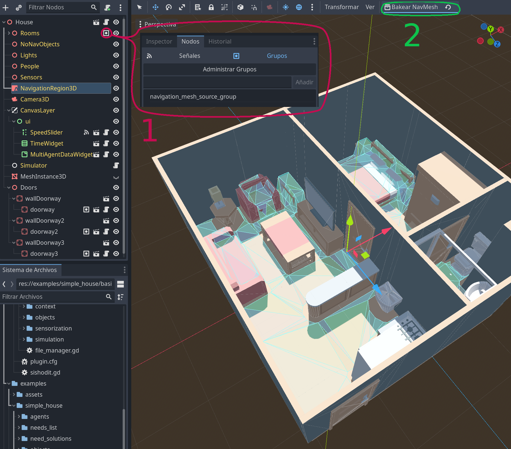

# SiSHoDiT
SiShoDiT (**Si**mulator of **S**mart **Ho**uses **Di**gital **T**wins) is a fully automated simulator for Activities of Daily Living (ADLs) in smart homes environments that allows emergent behaviour. It is build to work inside Godot Engine editor, but the tools provided with it can be used to generate a standalone executable.

## Getting started
This tutorial assumes the reader has some knowledge of Godot Engine, specially regarding to using the tool, basic concepts (like nodes, scenes, groups, etc.) and basic 3D level design inside the editor. The simulator has two main independent parts: agents and environments.

By playing the project, each of the defined scenarios can be simulated, allowing the selection of a seed to provide more control to the user. When a simulation is ended, it generates a file including all the sensors triggered which is stored inside the [user data folder](https://docs.godotengine.org/es/stable/tutorials/io/data_paths.html).

### Agents
An agent is an entity that moves on an environment an performs activities to solve its needs. A need can be solved through a solution which is composed by steps as the figure bellow shows. How the metamodel for defining the behaviour works is specified in [paper pending to be published].

In *res://people/basic_person.tscn* the basic structure of an agent can be found. The settings of their behaviour can be stablished in its parent node.

### Environments
An environment is a collection of objects that form the scenario and that can provide utility to the agent to solve its needs. In *res://scenary/enviroments/others/base_environment.tscn* there is a template for building a environment and in *res://scenary/enviroments/* there are environment examples. Most environments can be built by including the objects, walls and doors inside the scene. Objects with collision and relevant for the pathfinding of the agent should be included under "Rooms" node or under other node that is included into the group "navmesh". The agent should be included also under the node "People" and positioned in the right place for this simulation.

Once every object is placed the navigation mesh must be baked.

Inside an environment the most important elements are the object the agent can interact with. The most fundamental factor in an object are their groups, as they inform about the utilities of that object. For example, a kitchen sink can be included in the groups *drink_source* and *dish_washing* so it could be chosen as an object to be used for every step that include any of those groups as keys. 

Most of the times an object is just a static body or just a mesh, but sometimes it must include a sensor. For that, as a way to simplify the process, "Usable" nodes can be used. Currently there are 4 types of "Usable" nodes, but more can be created by inheritance of *AbstractUsable*.

- **Usable**. This triggers a sensor when the agent starts using the object producing a value parametrizable by the user and also when the agent finish using it, allowing the user to parametrize this value too.
- **SingleTriggerUsable**. This works as the previous one, but it is only triggered when the user starts using object.
- **SwitchUsable**. This is trigger only once while being used by the agent at start or end depending on a parameter. It has two states: switched and not switched. Each time it is used it changes between states. Each state produces a sensor output that can be stablished by the user. This type of sensor is useful for devices like TV.
- **DurationUsable**. This is triggered at the start or the end of the agent using the object depending on a parameter stablished by the user. It allows including a duration in seconds after which it will be triggered again.

## Credits

All 3d assets by Kenney

[textures/grass.jpg](https://opengameart.org/content/4-cartoony-terrains-textures) by Danimal