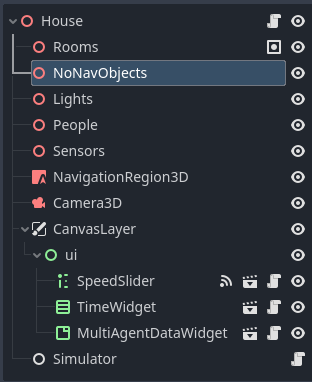

# Tutorial

Before starting the tutorial, my first advise is to get acquainted with Godot editor in general and with 3D editor in particular.

## Setting up the environment

It is recomended to start setting up the simulation starting from the representation of the physical environment, and, after that, to continue setting up the agents and final details.

### Understanding the node structure
The image below shows the basic node structure for an environment. It can be simplified by a lot, but the included nodes help for managing the elements needed in the simulator.

Next, each node will be explained:

* **Organization nodes**. The nodes **Rooms**, **NoNavObjects**, **Lights**, **People**, and **Sensors** are only included for containing other nodes in an organized way. The kind of nodes that should be children of these ones, will be explored in deep later.
* **NavigationRegion3D**. This node is used for defining the area on which the Agents can move. Later, it will be show how to use it, but you can find more information in the [Godot docs](https://docs.godotengine.org/en/stable/tutorials/navigation/navigation_introduction_3d.html).
* **Camera3D**. This camera is the default one that will be used for the simulation. You can change its position wherever you need or any other of their properties. The Agents will also have their own cameras that can be swapped during the simulation.
* **GUI nodes**. Under **CanvasLayer/ui** there are 3 GUI related nodes:
  * The **SpeedSlider** is used for increasing the speed of the simulation, which can reduce the accuracy.
  * The **TimeWidget** shows the date and time of the simulation.
  * The **MultiAgentDataWidget** shows information related with the behaviour of the Agent. It is particulary useful for debug purposes.
* **Simulator**. This is one of the most important nodes for the simulation. It manages the internal variables of the simulation and syncronizes every Simulable object.
  
### Building the house structure

The ideal way to start building the house is starting from its floor and walls, and for helping in that purpose we are using a reference [blueprint](http://4.bp.blogspot.com/--odh3hnCIr0/UjfM3k2v6hI/AAAAAAAAowg/GKUlVsCy6vs/s1600/casa+1+quarto+5.jpg).

