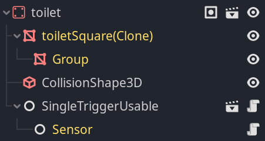

# Tutorial

Before starting the tutorial, my first advise is to get acquainted with Godot editor in general and with 3D editor in particular.

## Understanding the big picture
This tool is designed to create simulations of agents that imitates people inhabiting a sensorize environment with resources to manage the needs of those agents. There are two types of objects that contribute to play the simulation properly, the **Simulator** and the **Simulable**.

* The **Simulator** is in charge of handling the internal time of the simulation and synchronizing the other objects. It also has the capability of doing time skips in the simulation for making it faster.
* The **Simulable** is a type of node that must be attached to every node that require active simulation, which includes *Agent*s and *Sensor*s mainly, but also other special nodes that will be explained in deep later. An example of node that shouldn't need to be *Simulable* is a wall, for example, given that it is completely static and not sensorized in any way. The *Simulator* only works directly with *Simulable* objects, and the parents of those communicate with the *Simulator* through their children.

In essence those two are the main tools of SiSHoDiT and any user could implement any other part from those, however, the addon includes a lot of tools to set up an environment without needing to add a single line of code.

## Setting up the environment

It is recomended to start setting up the simulation starting from the representation of the physical environment, and, after that, to continue setting up the agents and final details.

### Understanding the node structure
The image below shows the basic node structure for an environment. It can be simplified by a lot, but the included nodes help for managing the elements needed in the simulator.


Next, each node will be explained:

* **Organization nodes**. The nodes **Rooms**, **NoNavObjects**, **Lights**, **People**, and **Sensors** are only included for containing other nodes in an organized way. The kind of nodes that should be children of these, will be explored in deep later.
* **NavigationRegion3D**. This node is used for defining the area on which the *Agent*s can move. Later, it will be show how to use it, but you can find more information in the [Godot docs](https://docs.godotengine.org/en/stable/tutorials/navigation/navigation_introduction_3d.html).
* **Camera3D**. This camera is the default one that will be used for the simulation. You can change its position wherever you need or any other of their properties. The *Agent*s will also have their own cameras that can be swapped during the simulation.
* **GUI nodes**. Under **CanvasLayer/ui** there are 3 GUI related nodes:
  * The **SpeedSlider** is used for increasing the speed of the simulation, which can reduce the accuracy.
  * The **TimeWidget** shows the date and time of the simulation.
  * The **MultiAgentDataWidget** shows information related with the behavior of the *Agent*. It is particularly useful for debug purposes.
* **Simulator**. This is one of the most important nodes for the simulation. It manages the internal variables of the simulation and synchronizes every *Simulable* object.
  
### Building the house structure

The ideal way to start building the house is starting from walls, and for helping in that purpose we are using a reference [blueprint](http://4.bp.blogspot.com/--odh3hnCIr0/UjfM3k2v6hI/AAAAAAAAowg/GKUlVsCy6vs/s1600/casa+1+quarto+5.jpg). All the models used here are created by [Kenney](https://www.kenney.nl/assets/furniture-kit). The picture below shows the placement of the walls.


As can be noted, the walls are not an exact match for this example. That's mainly because it is difficult to adjust it perfectly with the models used, but depending of your needs you can used more appropriated assets. The next step consist of finishing the structure by adding the floor and the doors.


### Furnitures structure

Now, the next step is adding furniture, but before that, let's dig into a furniture structure. The picture below shows the node tree of a toilet. 



Next, each part of the node tree is explained more in deep:

* **toilet (StaticBody3D)**. The root is a static body to handle collisions. It could be any type of Node3D, but many times it is needed to handle collisions, so typically StaticBody3D are preferred. It is relevant that it belongs to a group, which, despite is not showed in the picture, is called also "toilet". Every furniture that can be actively used by an *Agent*, must belong to one or more groups that informs about the utility of the object.
  * **toiletSquare (MeshInstance)**. This node and its child provide the visual representation of the object. It is not needed, but also very frequent.
  * **CollisionShape3D**. The node that defines the collision used by its parent. Godot allows computing it automatically from a MeshInstance.
  * **SingleTriggerUsable**. This is an Usable node. Those are a special type of nodes created for this addon that informs that the *Agent* can use them in a particular way. We will explore this type of nodes later.
    * **Sensor**. This node produces values that are logged into the output file that contains the result of the simulation. We will also explore this node later.
  
This structure can be much simpler having only a node belonging a group or even more complex having multiple meshes or sensors, but most of them will look just as the example shown.

### Usable Nodes
When an Usable node is child of an object, it allows a specific way of using that object defined by the Usable node itself. Usable objects have three main steps when used: start using, being used, and finish using. There are multiple Usable nodes predefined in the addon, but the user can create their own ones by creating a script inheriting from Usable and overriding its methods. The predefined Usables are stored as scenes that can be found in *res://addons/sishodit/tools/objects/usables* and the list can be seen below.

* **BasicUsable** produces a value through a sensor when the agent starts using it, and another one when it finishes. Both values can be configured by the user.
* **SingleTriggerUsable** is only triggered once, at the beginning of using it or at the end, which is decided by the user.
* **DurationUsable** inherits from *SingleTriggerUsable* and its only triggered once by the Agent, but it produces another value after a specified quantity of time has passed.
* **SwitchUsable** triggers only once when the agent uses it, similarly to *SingleTriggerUsable*, but it keeps an internal state that register wether it is switched on or off, and, based on this state, it produces a different value whenever it is switched.
* **RedirectUsable** is the most different one, because its job is to mask another *Usable* object selectable by the user that will be used when the *RedirectUsable* is. This is useful, when you need to simulate an object with multiple internal sensors, but only one of them is relevant for the produced dataset.

As told before, these are simple but useful examples of Usable nodes, but much more complicated ones can be implemented if needed.

### Sensors
A type of node that represents a sensor deployed in the smart environment. They have a *Simulable* child, so they are considered *Simulable* entities. They have the capability of managing uncertainty by producing wrong triggers if the user parametrized them that way. The main parameters of a sensor are the next ones:
* **Sensor Name** is the name of the sensor that will appear in the output.
* **Sensor Type** is also information that appears in the output that can be used for classify sensors in different categories.
  
Besides those, there are also parameters to simulate malfunction of uncertainty:
* **Value Range** is a type of object that defines which range of values can produce the sensor in their outputs, which is used mainly for keeping the uncertainty results within correct ranges. Currently there are three types of ranges: binary, discrete and continuous, but more can be implemented by the user if needed.
* **Not Triggered Probability** is the probability of not being triggered when it should.
* **Wrong Value Probability** is the probability of generating a wrong value when the sensor is triggered.
* **Average Time Between Wrong Triggers** and **STD Time Between Wrong Triggers** are the mean and standard deviation of a normal distribution from which the time that will pass until the sensor is triggered when it should not is obtained.

### Continuous sensors
These are a special type of sensors that log data continuously at a specified rate. For example, a continuous sensor with a sample rate of 0.25 in a simulation of 100 seconds will log up to 100\*0.25 = 25 samples. They have the next parameters:

* **Sample Rate** represents how many values are logged per second.
* **Activations Templates** is a dictionary that describes how the continuous sensor will behave when certain activation is received. The key is the value at which the the sensor is activated and the value must be a *Template*. A *Template* defines the shape of the time series generated. It does it in base on its parameters:
  * **Segments** represent parts of the signals and are defined in base of the next parameters:
    * **Shape** is a *Curve* that represents the general shape of the segment.
    * **Duration** is how much time it is needed to fully represent the shape. During the simulation, the segment can be interrupted, if the sensor receives a new activation.
  * **Postprocessings** define operations applied to the values produced by the segments. Actually there are three types of postprocessings:
    * **TSPPAbsolute** returns the absolute value of the input.
    * **TSPPScaler** multiplies the input by the specified value.
    * **TSPPGaussianNoise** adds a random value chosen from a Gaussian distribution with a mean of zero and a standard deviation specified by the user.
  * **Random** is a boolean value that when true selects a random segment each time the previous have finished instead of the next one.
  * **Loop** is a boolean value that when true the first segment is chosen after the last one finishes. Ignored if random is true.
* **Default Activation Index** is the index of the template that will be chosen by default.

For the rest, they work in the same way than the other *Sensor*s. However, it is important to have into account that simulations can be very slower with very high frequencies.
  
### Placing furniture
In this step the house will be completed by adding the remaining furniture as depicted in the image. Most of the furniture are built with a structure similar to the toilet example of before. **It is important to remember that every object with a function in the needs of an Agent, should belong to a group identifying the need**. The final distribution is a bit different to the blueprint to adjust better the space.


### Baking the navmesh
This is the last step regarding the environment setup, and it is needed to define the area over which the Agent can move. As the image below show, first you have to include every collision object as child of a node belonging to *navigation_mesh_source_group*, in this case Rooms node (this can be changed if needed). It is important, given how the doors work, to keep them out of the Rooms node, because we want the agent to be able to walk across doorways. Once this is done, you only need to select the NavigationRegion3D node and click on "Bake NavMesh". You can adjust the parameters of this node to change the walkable size to the requirements of your Agent.


### Finishing touches
For finishing setting the environment here is a list of advices to follow:
* Placing correctly the main camera to being able to watch correctly the simulation
* Adding a main light source to the scene
* Adding a WorldEnvironment

## Setting up the Agent
The Agent is the main actuator in the simulation. It is the one that interacts with objects and sensors to trigger them. In this section, we are not going to deepen on the node structure of the Agent, but we are going to focus in deep on how its behavior can be configured. By default, the Agent model is a green capsule, but you can change it if preferred.

### Needs
At a first instance, an Agent is defined by its needs. Within Godot, needs are resources, that can be stored in disk and parametrized individually. A need in the simulator resembles to a real need, for example eating. The simulator models a need as a progress bar that gets filled as the time passes, and, depending on its value, it is selected to be solved or not. The figure below shows how to add a new need to an agent. It can be added via clicking on *New NeedInfo* and be stored within the Agent scene, or you can create it inside another folder to reuse it between multiple agents (this also applies to Solutions and Steps, that will be explained below).


In the picture, the list of parameters of a need is also shown. Let's revise them:
 * **Need Key**. This identifies uniquely the need, you should not include more than one need in the same Agent with the same name.
 * **Solutions**. The list of possible solutions for the need. They can be added in a similar way than needs to the agent. In the next section we will see the characteristics of solutions.
 * **Time to Fill Level**. This is the time in seconds needed until the need is completely filled.
 * **Initial Level**. This is the percentage of the need filled when the simulation starts. It is important to have in mind that a higher value means a more urgent need.
 * **Min Level Before Solve**. The minimum percentage needed for a solution before being selectable to be solved. Notice that the value is set to -0.01. Normally this should not be done, except for one need for each Agent, which will be the default need if no other is available.
 * **Priority**. A need with a higher priority than a step currently being performed can interrupt it if it's urgent enough.
 * **Urgent Level**. The percentage the need must reach to be considered urgent, by default is 100%.

### Solutions
Solutions are series of steps that can be used to solve a need. Between all the solutions available for a need one is randomly chosen depending on its weight.


As can be seen, a solution have less parameters than a need:
 * **Steps**. The sequence of steps that should be executed to apply the solution.
 * **Weight**. Increasing the weight, makes the chances of this solution to be chosen over other ones. For example, in a need with 3 solutions, *sol1* and *sol2* with a weight of 1 and *sol3* with a weight of 2, the probabilities of choosing each of them will be the next: *sol1* - 25% (1/4), *sol2* - 25% (1/4), *sol3* - 50% (2/4).
 * **Condition Manager**. A condition manager can be used to add prerequisites for a solution to be selectable in base of a context, for example the hour of the day. More will be seen about context and conditions in their own section.
 * **Resource Name**. It is always good to add a name for the solution, cause it will help in debugging and for the output file.

### Steps
A step is a single action that must be performed in the process to apply a solution. It usually implies interacting with an object.


As the image show, step has many more parameters than the other resources, but they are grouped to work with them in a better way.

* **Object.** This group of parameters refers to how the Agent interacts with physical objects.
  * **Object group.** This is the group to which the object to be used in this step belongs. More than one object can be included in this group.
  * **Object Selection Criterion.** If more than one object belongs to the required group, the chosen criterion will be used for selecting the object. The available criterions are *Random*, *Nearest*, and *Furthest*.
  * **Use object.** If marked and the object has an Usable child, the Agent will use it.
* **Duration.** This group is composed by the two parameters below, along with an alias that will be used for referring to them. These parameters are used to obtain the time needed for performing the step. The value is randomly chosen from a normal distribution with a mean of *(m + M) / 2* and a standard deviation of *(M - m) / 8* and clamped between *m* and *M*. 
  * **Min Duration**: *m*.
  * **Max Duration**: *M*.
* **Needs.** This group establishes how steps interacts with the needs. All of them include a text field and a slider for each need you need to affect. The text field is used for referring to the need key that this step will affect, while the slider moves from 0 to 1 for defining how much the value will be affected.
  * **Needs Solved.** These needs will be solved by the indicated value. Most of the time it will be fine with 1.
  * **Needs Increased.** These needs will be increased by the specified value. This is useful for steps like doing exercise, which can increase the need of resting or the hygiene.
  * **Needs With Modified Rate.** These makes the specified need to fill slower or faster. The value can be increased over 1 if needed by overriding manually the value.
* **Step fine tuning.** For last, this group allows to make the step work in a more specific way.
  * **Priority.** This value overrides the priority of the need being solved if it is bigger, which is useful for critical steps.
  * **Cancel on Interruption.** If this box is ticked and the step is interrupted, both the step and the solution will be canceled.
  * **Condition Manager.** If present, the step is considered optional and, if the conditions are not met the step will not be performed and the next one of the solution will be the one the agent will execute instead.
* **Resource Name**. It is the same than for solutions.

In the tutorial scenes you can see the final behavior settings for the tutorial Agent.

## Context and conditions
Sometimes, you need to add extra requirements for solutions and steps based on context. Luckily, this tool allows you to include context variables to the simulation.

### Simulation context
Context is shared between Simulator and Simulable entities, and when modified from one, it is modified for every other one too. Simulator never modifies the context directly, so modifications must be done by the *Simulable*s. By default, SiSHoDiT includes one for calendar management that allows setting the initial date and time of the simulation as depicted in the picture.


It is relatively easy to develop more context managers if needed, but that is out of the scope of the tutorial. It is probable that in the future more context managers will be added.

### Condition Manager
Let's supposes that we have included the calendar manager in our scene tree. That adds *year*, *month*, *day*, *weekday*, *hour*, *minute*, and *second* as context keys. Now we can add conditions based on those keys for accepting solutions. In this example we are going to show the example of sleeping at night in the bed which will be limited between 22:00 and 6:00 of the next day. 

The Condition Manager is a list of conditions with a specified evaluation mode. Conditions are evaluable as boolean, and evaluation mode determines what result must produce the conditions to consider that the solution can be applied. Its value can be *All* if every condition needs to be true or *Any* if only one condition needs to be true. 

A Context Condition is define by 3 parameters, the context *key* that is going to be evaluated, how the *comparison* is going to be made(<, <=, ==, > or >=), and which *value* it is going to be compared with the context.


The example above shows two conditions related to the *hour* key, but only one needs to be evaluated as true, being the final condition: *hour* >= 22 or *hour* <= 6. That delimits the range between 10:00 PM and 6:00 AM.

## Executing the simulation
Ok, so now we have our simulation completely set up, how we run it? There are 3 different ways to do it. 

First method is running the scene directly from the Godot editor by pressing F6 or clicking the "Play current scene" button. 

The second one is executing a *main_menu* scene. You can find a example one in the examples folder called *examples_menu.tcsn*. When the simulator is launched using this menu, the user can select which scenery the want to run and specify a seed, so the random events of the simulation can be deterministic if the simulation is rerun using the same parameters (by default, the value 0 means a random seed will be used).

The third method is based in the other two and consist of compiling an executable, so it can be shared with other users without needing Godot editor. You can learn more about this in [Godot docs](https://docs.godotengine.org/en/stable/tutorials/export/exporting_projects.html).


### Produced data
When a simulation ends, it generates a file including all the sensors triggered and the Agent activities inside the [user data folder](https://docs.godotengine.org/es/stable/tutorials/io/data_paths.html). The output file has a JSON format as the next code block shows:

```json
[
{"from":"Agent","time":125.620760902918,"type":"activity_begin","value":"Sit"}, 
{"from":"loungeSofa","time":128.312914715724,"type":"pressure","value":1}, 
{"from":"loungeSofa","time":3070.14222560836,"type":"pressure","value":0}, 
{"from":"Agent","time":3070.14222560836,"type":"activity_end","value":"Sit"}, 
{"from":"Agent","time":3070.14222560836,"type":"activity_begin","value":"Eat something"}, 
{"from":"KitchenFridge","time":3071.6847617577,"type":"contact","value":1}, 
{"from":"KitchenFridge","time":3114.33692886472,"type":"contact","value":0}, 
{"from":"Agent","time":3710.29161258931,"type":"activity_end","value":"Eat something"}
]
```
It is a list in which each entry contains 4 keys:
* **from**. The issuer of the entry, normally a sensor. Sometimes the Agent appears in this field because usually is interesting for this type of datasets to know what is the Agent doing for triggering the sensors.
* **time**. The time from the beginning of the simulation in which the entry is generated.
* **type**. The type of the entry. Most of the times refers to the type of sensor that has produced the entry, but for Agents it establishes the state of the activity.
* **value**. The output produced by the issuer of the entry. For sensors, it is the value it has produced, for the Agent the name of the activity ended or started.